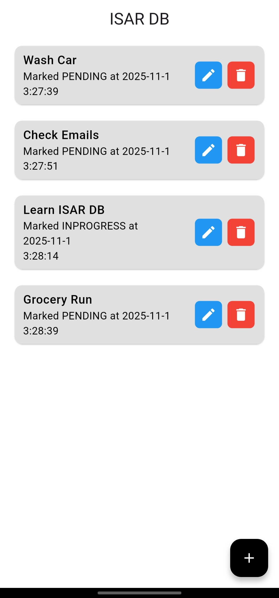
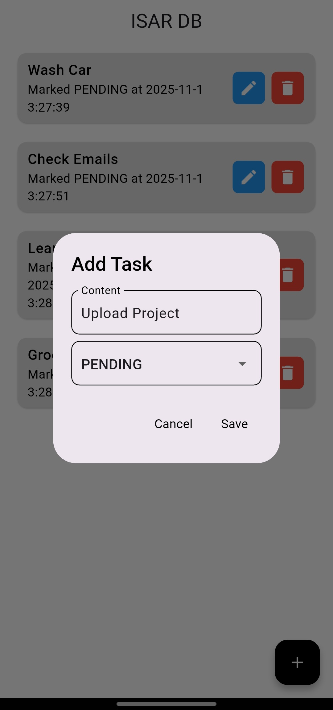
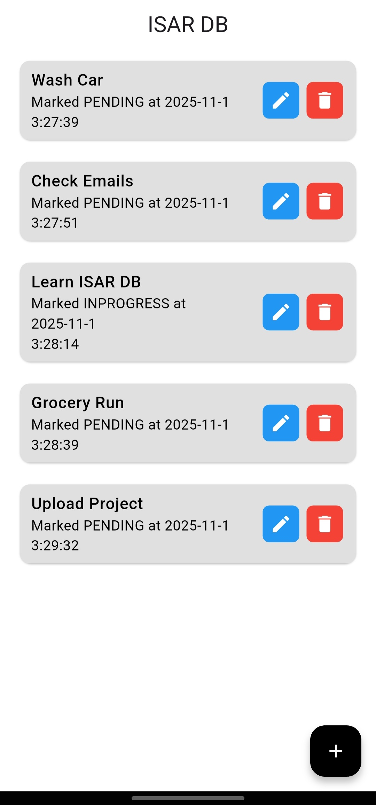
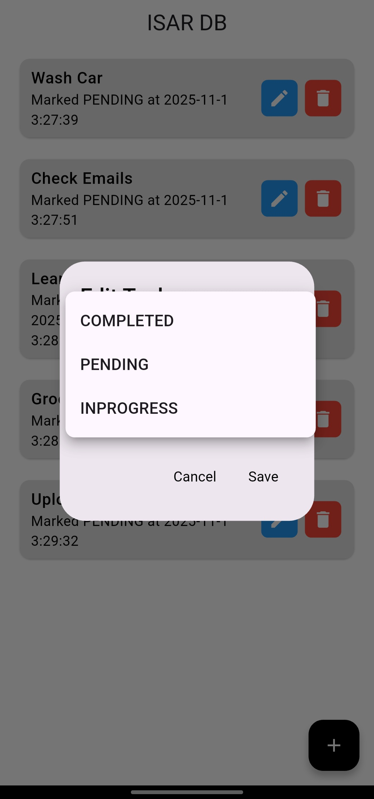
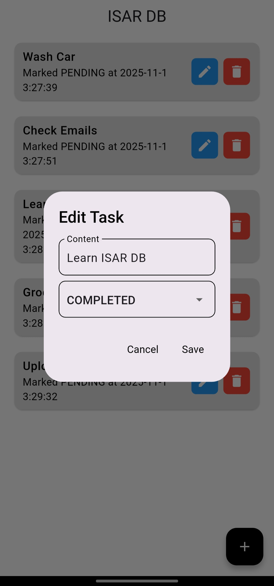

# ISAR ToDo App 📝

A simple **Flutter To-Do application** built using the **Isar database** — a lightning-fast local NoSQL database for Flutter.  
This app demonstrates complete **CRUD operations (Create, Read, Update, Delete)**, real-time UI updates with **streams**, and a clean, modern interface for managing your daily tasks.

---

## Features 🚀

- **Add Tasks** ➕  
  - Create new ToDo items with content and status.  
  - Automatically saves creation and update timestamps.

- **View Tasks** 👀  
  - Displays all ToDo items stored locally in Isar.  
  - Updates in real-time as data changes.

- **Edit Tasks** ✏️  
  - Modify task content or change its status (e.g., pending, completed).

- **Delete Tasks** ❌  
  - Remove unwanted tasks from the database instantly.

- **Realtime Updates** 🔄  
  - Uses `watch()` stream listener to refresh the UI automatically on database change.

- **Offline Persistence** 💾  
  - Data is stored locally using Isar, making it accessible even without an internet connection.

---

## 📸 Screenshots

### **Home Screen**
> Displays a list of tasks fetched from Isar in real time.
<p>

</p>

### **Add New Task**
> Add a new ToDo item with content and a selectable status.
<p>


</p>

### **Edit Task**
> Update the task’s content or change its status.
<p>




</p>

### **Delete Task**
> Instantly remove tasks from the Isar database.
<p>

</p>

---

## Dependencies 📦

This project uses the following dependencies:

| Package | Version | Description |
|----------|----------|-------------|
| [`isar`](https://pub.dev/packages/isar) | ^3.1.0+1 | Super-fast local NoSQL database for Flutter. |
| [`isar_flutter_libs`](https://pub.dev/packages/isar_flutter_libs) | ^3.1.0+1 | Native Isar bindings for Android, iOS, and desktop. |
| [`isar_generator`](https://pub.dev/packages/isar_generator) | ^3.1.0+1 | Code generator for Isar model schemas. |
| [`build_runner`](https://pub.dev/packages/build_runner) | any | Runs code generation for Isar schema files. |
| [`path_provider`](https://pub.dev/packages/path_provider) | ^2.1.5 | Used to locate the directory where the Isar database is stored. |
| [`flutter`](https://flutter.dev) | Latest | UI framework for building cross-platform apps. |

---

## 🛠️ Tech Stack

- **Flutter** – Cross-platform UI toolkit.  
- **Dart** – Programming language used for Flutter.  
- **Isar Database** – Offline-first NoSQL database for Flutter.  
- **VS Code / Android Studio** – Development environment.  
- **Git & GitHub** – Version control and code hosting.

---

## ⚙️ Setup Instructions

### Clone and Run
   ```bash
   git clone https://github.com/muhammadXainAhmad/isar_db_flutter
   cd isar_db_flutter
   flutter pub get
   flutter run
```

## License 📄
This project is licensed under the [MIT License](LICENSE).